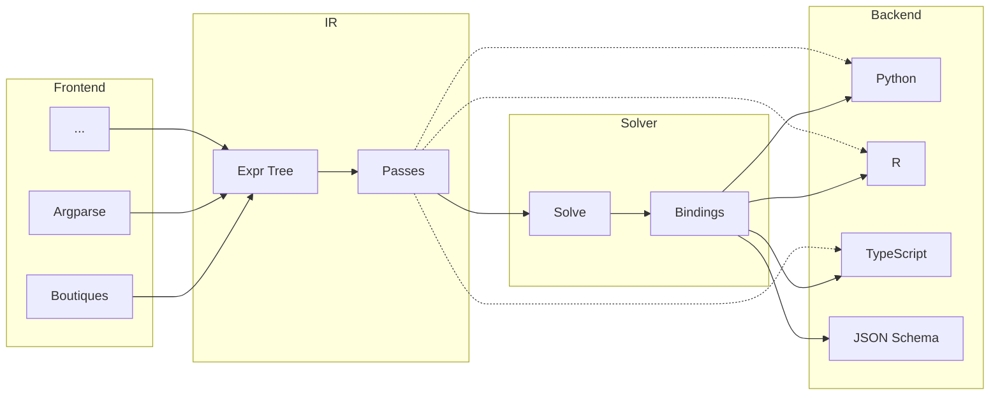

# Architecture

A compiler for CLI interface specifications. Parses CLI definitions from various sources, optimizes the intermediate representation, solves for minimal parameter bindings, and generates typed wrappers and schemas for multiple target languages.

## Pipeline

## Core Concepts

| Module        | Purpose                                                                                                                    |
| ------------- | -------------------------------------------------------------------------------------------------------------------------- |
| **ir**        | Canonical expression tree (Expr = Literal \| Sequence \| Alternative \| Optional \| Repeat \| Int \| Float \| Str \| Path) |
| **ir/passes** | Optimization passes: flatten, simplify, canonicalize, remove-empty                                                         |
| **bindings**  | Solved types (BoundType = scalar \| bool \| count \| literal \| optional \| list \| struct \| union \| nullable)           |
| **solver**    | IR → Bindings via pattern matching                                                                                         |
| **manifest**  | Optional metadata: Project > Package > App                                                                                 |
| **frontend**  | Parsers producing IR                                                                                                       |
| **backend**   | Code generators consuming IR + Bindings                                                                                    |

## Solver Patterns

| IR Pattern              | BoundType            |
| ----------------------- | -------------------- |
| `optional<literal>`     | `bool`               |
| `repeat<literal>`       | `count`              |
| `optional<T>`           | `optional<solve(T)>` |
| `repeat<T>`             | `list<solve(T)>`     |
| `sequence<...named...>` | `struct<...>`        |
| `alternative<...>`      | `union<...>`         |
| terminal                | `scalar`             |

## Design Philosophy

The key architectural improvement over Styx 1 is a clean separation of concerns for backends:

- **Solved bindings -> parametrization** - the solver (`solver/solver.ts`) walks the IR once and pattern-matches into a `BoundType` tree (bool, count, optional, list, struct, union, etc.). Backends translate these into the typed parameter interface that users interact with.
- **IR -> argument building logic** - the expr tree describes how to construct the command line (sequences, optionals, alternatives, literals). Backends translate the IR into runtime code that assembles CLI invocations, pulling values from the solved parameters to fill each slot.

The IR is the skeleton of the command line; the bindings define the typed interface; the argument builder walks the IR and pulls from the parametrization to assemble the final invocation. In Styx 1, these concerns were entangled - each backend had to re-derive types from the IR via a complex `LanguageProvider` protocol. In Styx 2, backends receive both pieces pre-computed and just translate them into target language constructs.

## Styx 1 vs Styx 2

| | Styx 1 (Python) | Styx 2 (TypeScript) |
|---|---|---|
| **IR** | Dataclass hierarchy (`Param[T]` with body types) | Algebraic expr tree with `kind` discriminant |
| **Optimization** | Minimal (string merging) | Pass-based pipeline (flatten, simplify, canonicalize) |
| **Type resolution** | Direct mapping in frontend; each backend re-derives types via language provider protocol | Solver produces a universal `BoundType` tree; backends just translate it |
| **Backends** | Python mature, TS/R partial; each implements a complex `LanguageProvider` protocol | All stubs (architecture in place); should be simpler since solver does the heavy lifting |
| **Output files** | First-class: path templates with param refs, suffix stripping, fallbacks | Not yet modeled to the same degree |

Key Styx 1 features to eventually match:
- **Output path templates** - `"output-[X].nii.gz"` parsed into literal + `OutputParamReference` tokens with suffix stripping and fallbacks
- **Conditional groups** - command-line args only emitted when at least one param in the group is set

## Roadmap

Long-term, Boutiques shifts from being the primary frontend to primarily a **backend** (for cross-compatibility and bootstrapping NiWrap onto the new compiler). Planned frontends:

- **Custom TypeScript-types-like language** - the intended primary way to define CLI specs
- **Serialized Python argparse** - parse argparse definitions
- **Boutiques** (current) - remains as both a frontend and a backend

## Ecosystem Context

This compiler is part of the **Styx/NiWrap ecosystem** ([niwrap.dev](https://niwrap.dev/)):

- **Styx compiler** (this repo) - generates type-safe bindings from CLI tool descriptions
- **NiWrap** - Boutiques descriptors for ~2,000 neuroimaging tools (FSL, FreeSurfer, ANTs, AFNI, MRTrix3, etc.) plus a build pipeline that feeds them through Styx to produce language-specific packages
- **NiWrap packages** - generated Python/TypeScript/R wrappers with IDE autocompletion and type checking
- **NiWrap Hub** - interactive web platform for exploring tools and generating code
