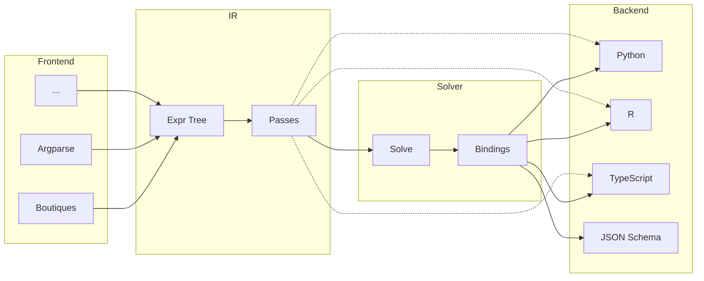

# Architecture

A compiler for CLI interface specifications. Parses CLI definitions from various sources, optimizes the intermediate representation, solves for minimal parameter bindings, and generates typed wrappers and schemas for multiple target languages.

## Pipeline

## Core Concepts

| Module        | Purpose                                                                                                                    |
| ------------- | -------------------------------------------------------------------------------------------------------------------------- |
| **ir**        | Canonical expression tree (Expr = Literal \| Sequence \| Alternative \| Optional \| Repeat \| Int \| Float \| Str \| Path) |
| **ir/passes** | Optimization passes: flatten, simplify, canonicalize                                                                       |
| **bindings**  | Solved types (BoundType = scalar \| bool \| count \| optional \| list \| struct \| union \| nullable)                      |
| **solver**    | IR → Bindings via pattern matching                                                                                         |
| **manifest**  | Optional metadata: Project > Package > App                                                                                 |
| **frontend**  | Parsers producing IR                                                                                                       |
| **backend**   | Code generators consuming IR + Bindings                                                                                    |

## Solver Patterns

| IR Pattern              | BoundType            |
| ----------------------- | -------------------- |
| `optional<literal>`     | `bool`               |
| `repeat<literal>`       | `count`              |
| `optional<T>`           | `optional<solve(T)>` |
| `repeat<T>`             | `list<solve(T)>`     |
| `sequence<...named...>` | `struct<...>`        |
| `alternative<...>`      | `union<...>`         |
| terminal                | `scalar`             |
